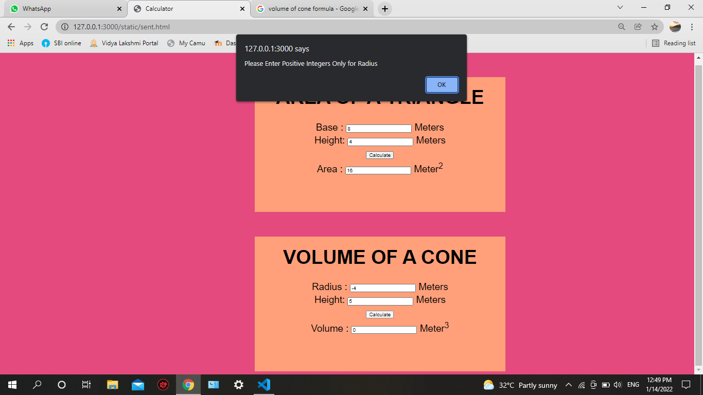
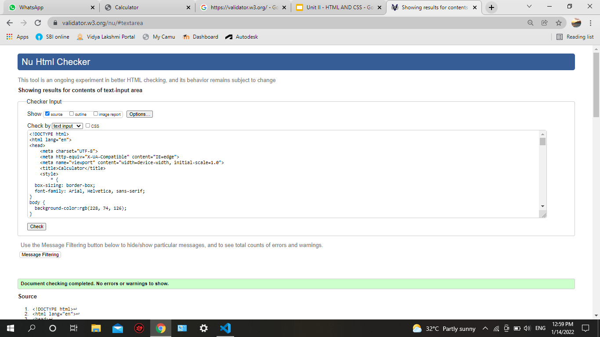

# Web Page for Mathematical Calculations

## AIM:

To design a static website with validation to perform mathematical calculations in client side.

## DESIGN STEPS:

### Step 1:

Requirement collection.

### Step 2:

Creating the layout using HTML and CSS.

### Step 3:

Write javascript to perform the calculations.

### Step 4:

Include regularexpression based input validation.

### Step 5:

Validate the layout in various browsers.

### Step 6:

Validate the HTML code.

### Step 6:

Publish the website in the given URL.

## PROGRAM :
```
<!DOCTYPE html>
<html lang="en">
<head>
    <meta charset="UTF-8">
    <meta http-equiv="X-UA-Compatible" content="IE=edge">
    <meta name="viewport" content="width=device-width, initial-scale=1.0">
    <title>Calculator</title>
    <style>
        * {
  box-sizing: border-box;
  font-family: Arial, Helvetica, sans-serif;
}
body {
  background-color:rgb(228, 74, 126);
}
.container {
  width: 1080px;
  margin-left: auto;
  margin-right: auto;
  padding-top: 30px;
  padding-left: 300px;
}
.content {
  display:block;
  width: 650px;
  background-color:lightsalmon;
  min-height: 350px;
  font-size: 25px;
}
h1{
    text-align: center;
    padding-top: 25px;
}
.formelement{
    text-align: center;
    margin-top: 5px;
    margin-bottom: 5px;
}
    </style>
</head>
<body>
    <div class="container">
        <div class="content">
            <h1>AREA OF A TRIANGLE</h1>
            <form>
                <div class="formelement">
                    <label for="bedit">Base    :</label>
                        <input type="text" id="bedit" value="0"/> <label>Meters</label>
                </div>
                <div class="formelement">
                    <label for="hedit">Height:</label>
                        <input type="text" id="hedit" value="0"/> <label>Meters</label>
                </div>
                <div class="formelement">
                    <input type="button" value="Calculate" id="addbutton"/>
                </div>
                <div class="formelement">
                    <label for="cedit">Area :</label>
                        <input type="text" id="cedit" value="0" readonly/> <label>Meter<sup>2</sup></label>
                </div>
            </form>

        </div>
    </div>
     <div class="container">
        <div class="content">
            <h1>VOLUME OF A CONE</h1>
            <form>
                <div class="formelement">
                    <label for="Redit">Radius    :</label>
                        <input type="text" id="Redit" value="0"/> <label>Meters</label>
                </div>
                <div class="formelement">
                    <label for="Hedit">Height:</label>
                        <input type="text" id="Hedit" value="0"/> <label>Meters</label>
                </div>
                <div class="formelement">
                    <input type="button"  value="Calculate"  id="volbutton"/>
                </div>
                <div class="formelement">
                    <label for="vedit">Volume :</label>
                        <input type="text" id="vedit" value="0" readonly/> <label>Meter<sup>3</sup></label>
                </div>
            </form>

        </div>
    </div>
    <script type="text/javascript">
        var button;
        button=document.querySelector("#addbutton");
        button.addEventListener("click",function(){
           var bastext,heitext,areatext;
           var basval,heival,areaval;
           var reg,res1,res2;

           bastext=document.querySelector("#bedit");
           heitext=document.querySelector("#hedit");
           areatext=document.querySelector("#cedit");
           reg=new RegExp("^[1-9]+[0-9]*$")

           basval=parseInt(bastext.value);
           res1=basval.match(reg);
           heival=parseInt(heitext.value);
           res2=heival.match(reg);
           if(res1==null)
           {
               alert("Enter a valid Base");
           }
           if(res2==null);
           {
               alert("Enter a valid Height");
           }
           areaval=0.5*basval*heival;
           areatext.value=""+areaval;
    });
  
    </script>  
    <script type="text/javascript">
        var button2;
        button= document.querySelector("#volbutton");
        button.addEventListener("click",function(){
            var radtext,heighttext,voltext;
            var radval,heightval,volval;
            var reg1,res3,res4;

            radtext=document.querySelector("#Redit");
            heighttext=document.querySelector("#Hedit");
            voltext=document.querySelector("#vedit");
            reg1=new RegExp("^[1-9]+[0-9]*$")

            radval=radtext.value;
            res3=radval.match(reg1);
            heightval=heighttext.value;
            res4=heightval.match(reg1);
            if(res3==null)
            {
                alert("Please Enter Positive Integers Only for Radius");
            }
            if(res4==null)
            {
                alert("Please Enter Positive Integers Only for Height");
            }
           
            volval=1/3*heightval*22/7*radval*radval;
            voltext.value=""+volval;


        });


    </script>   
</body>
</html>
```  


## OUTPUT:




## Result:

Thus a website is designed to perform mathematical calculations in the client side.
